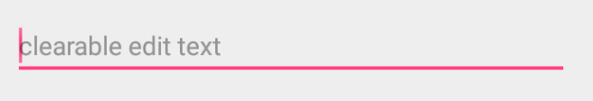
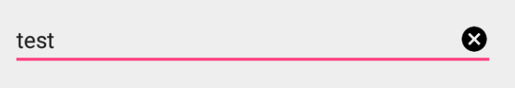

# ClearableEditText
A Clearable EditText for android, can custom the clear button icon and  size

## 简介
做项目的时候需要一个需求，要做一个带删除功能的EditText，感觉应该几分钟搞定，结果网上找了很多文章，都可以实现功能，但是删除的按钮图片大小都是固定的，没办法自定义和自适应。
花了一点时间改了一个可以自定义按钮大小的EditText，小伙伴们再也不用为了图片大小发愁了.

希望帮助有需要的人节省点时间。觉得好用的点个赞 ^_^。

## 效果：

## 用法
### Step1： 

添`"xmlns:app="http://schemas.android.com/apk/res-auto"`

        <LinearLayout
            xmlns:android="http://schemas.android.com/apk/res/android"
            xmlns:app="http://schemas.android.com/apk/res-auto"
            android:layout_width="match_parent"
            android:layout_height="match_parent"
            android:orientation="vertical">

### Step2：
设置自定义属性： \
**clearButtonIcon:** 显示图标 
**clearButtonIconWidth:** 显示图标宽度  
**clearButtonIconHeight:** 显示图标高度  

        <com.myf.wing.clearableedittext.ClearableEditText
            android:layout_width="match_parent"
            android:layout_height="wrap_content"
            android:layout_margin="30dp"
            android:hint="clearable edit text"
            app:clearButtonIcon="@drawable/icon_clear"
            app:clearButtonIconWidth="20dp"
            app:clearButtonIconHeight="20dp"
            android:textSize="15sp"/>

